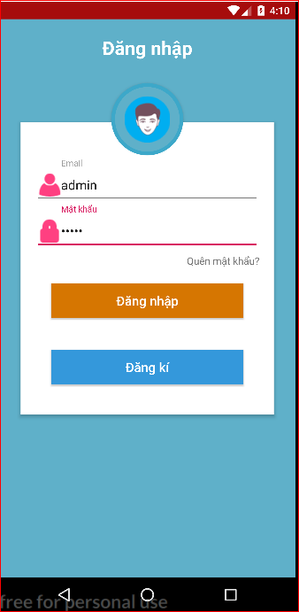
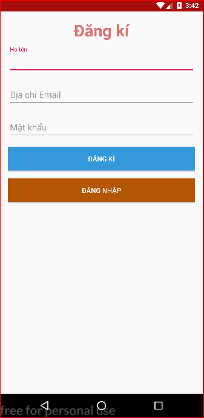
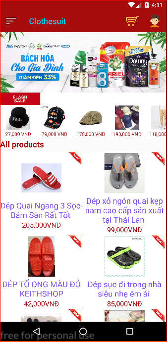
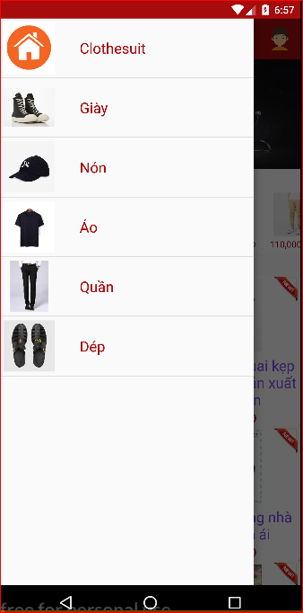
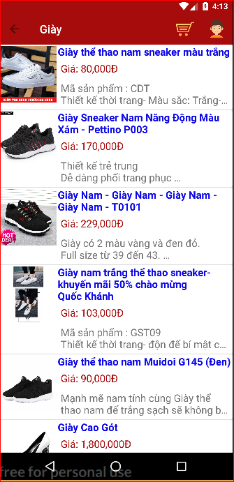
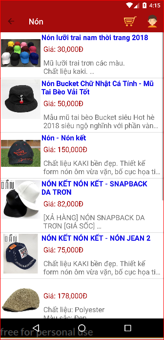
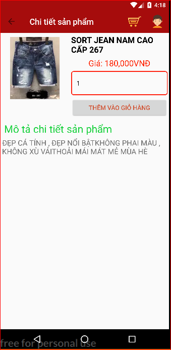

 
## ĐẶT VẤN ĐỀ
 - Do nhu cầu mua sắm của người Việt ngày càng tăng cao, nhằm nâng cao chất lượng mua sắm và thuận tiện nhất cho người dùng. Chúng tôi đã thiết kế app bán hàng online cho khách hàng, để khách hàng sử dụng và mua hàng online ngay tại nhà và bất cứ nỡi đâu cũng có thể mua được.
 - Để tránh tình trạng chen lấn, xô đẩy, mệt mỏi vào các dip tết, ngày lễ, ngày nghỉ khi shop đăng thông tin giảm giá. Nhằm cải thiện vấn đề nan giải này, đó cũng là mục đích khi chúng tôi thiết kế app này.
 - Tối ưu hóa tốt nhất cho app để người sử dụng có thể sử dụng một cách tốt nhất.
 ## CÁC CHỨC NĂNG CHÍNH:
  - Đăng kí tài khoản, đăng nhập
  - Danh sách các loại sản phẩm trong app 
  - Xem danh sách từng sản phẩm
  - Thông tin từng sản phẩm
  - Thông tin khách hàng
  - Danh sách các sản phẩm của khách hàng đặt mua
  - Màn hình xác nhận thông tin khách hàng mua hàng
 ## GIAO DIỆN CỦA ỨNG DỤNG  
 ### Đăng nhập / Đăng kí
 - Đăng nhập
 - Đăng kí
 

 
 

 
 ### Giao diện màn hình chính
   

 

 
 ### Danh sách các sản phẩm có ở app
 

 

 
 ### Xem danh sách từng sản phẩm
  

 
 

 
 ### Thông tin từng sản phẩm
  

  
 

 
 
